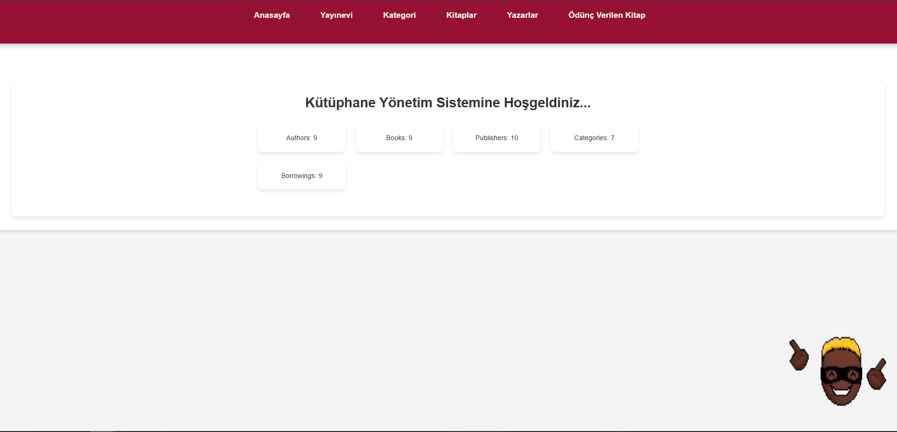
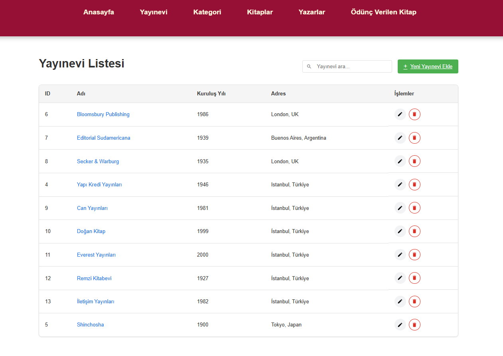
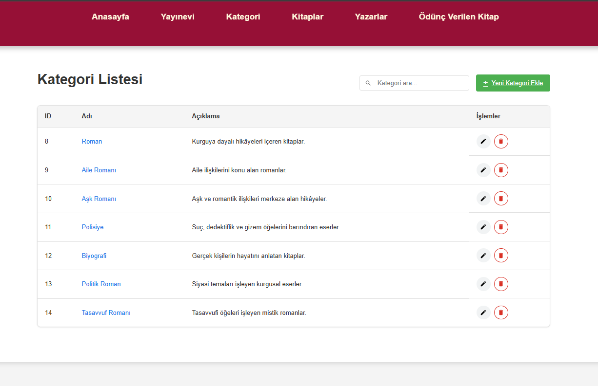
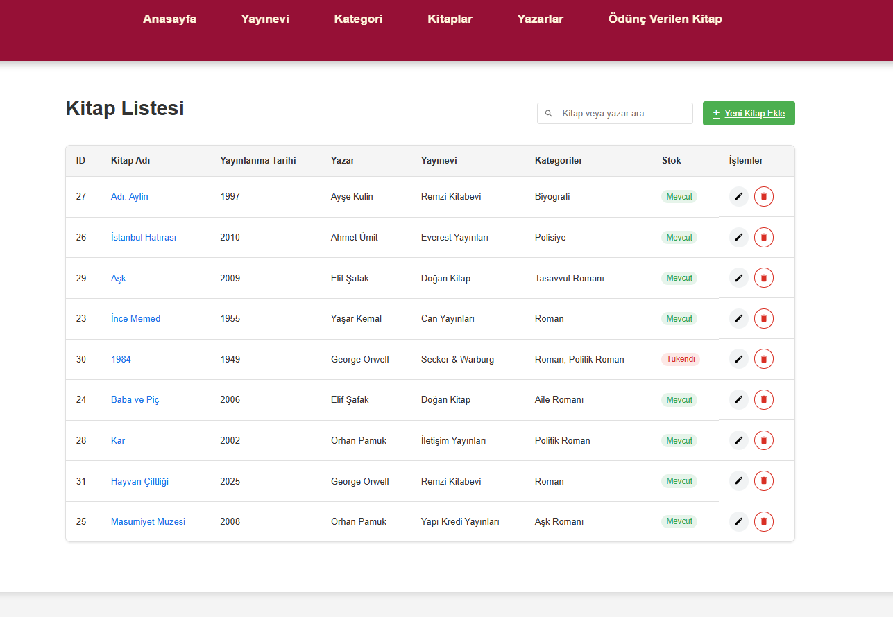
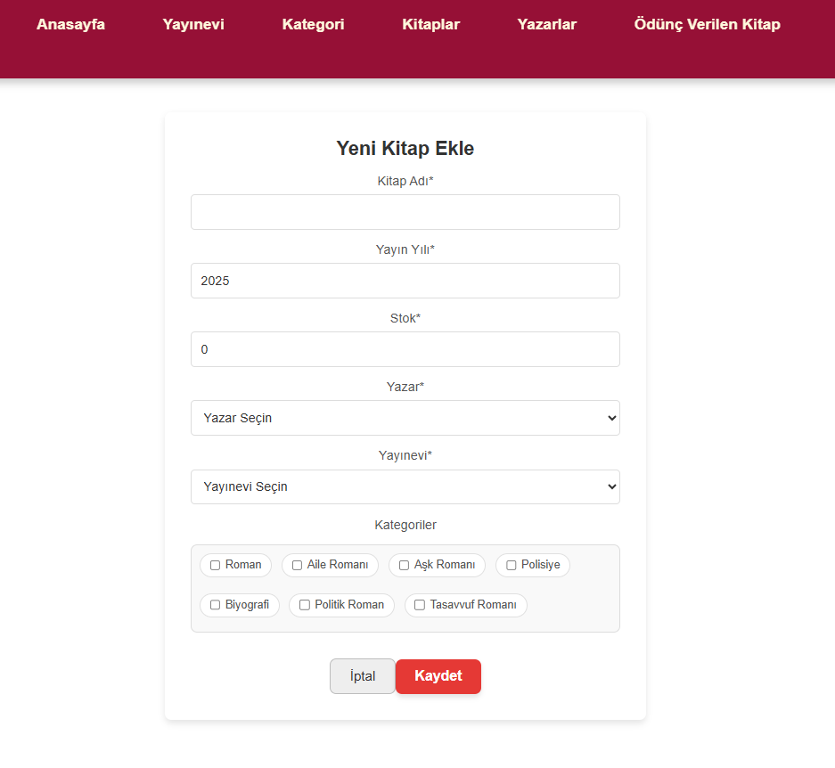
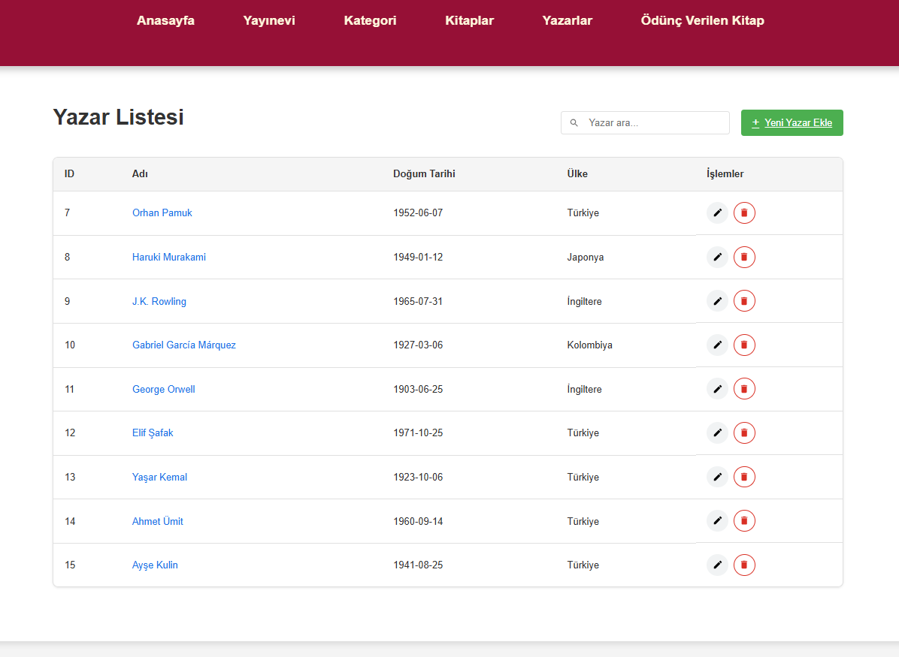

# Capstone Project - Kütüphane Yönetim Sistemi

Bu proje, React Router kullanarak tek sayfalık bir uygulama (SPA) geliştirilmesini amaçlayan bir kitap yönetim sistemi örneğidir. Kullanıcılar, kitaplarla ilgili CRUD işlemleri yapabilirler. Yayımcı, kategori, kitap, yazar ve kitap alma işlemleri üzerinde gerçekleştirebilecekleri işlemler mevcuttur.

## Proje Özeti

React Router kullanarak uygulama tek sayfa (SPA) şeklinde geliştirilmiştir. Her sayfada ilgili CRUD işlemleri yapılabilir. Ayrıca başarılı/başarısız operasyonlar sonucu kullanıcı bilgilendirilmektedir (window.alert kullanılmaz). Tasarım özgür olup, Responsive tasarım yapılmamıştır ve 1200px genişliğinde çalışması yeterlidir.

Proje, Backend ve Database üzerinden işlem yapabilmek için ilgili yapılandırmalar yapılmış ve canlıya alınmıştır. 

## Özellikler

- **Yayımcı**: Yayımcı bilgilerini görüntüleme, ekleme, güncelleme ve silme işlemleri.
- **Kategori**: Kitap kategorilerini görüntüleme, ekleme, güncelleme ve silme işlemleri.
- **Kitap**: Kitap bilgilerini görüntüleme, ekleme, güncelleme ve silme işlemleri.
- **Yazar**: Yazar bilgilerini görüntüleme, ekleme, güncelleme ve silme işlemleri.
- **Kitap Alma**: Kullanıcıların kitap satın alabilmesi.

## Kullanılacak Teknolojiler

- **Frontend**: React, React Router
- **Backend**: (Backend yapılandırması sizinle paylaşılacaktır)
- **CSS Framework**: Tailwind, Material veya Bootstrap (Seçiminize bağlı)
- **API Bağlantısı**: Axios
- **Veritabanı**: (Backend tarafından sağlanan veritabanı)

## Başlangıç

### Gereksinimler

- Node.js
- npm (veya yarn)

### Projeyi Çalıştırma

Projeyi yerel ortamınızda çalıştırmak için şu adımları izleyin:

1. **Proje dosyalarını indirin**
   ```bash
   git clone https://github.com/YasarDogann/Capstone-Project-Frontend.git

2. **Gerekli bağımlılıkları yükleyin**
    ```
    cd book-management-system
    npm install
    ```

3. **Projeyi başlatın**
     ```
     npm start


### CRUD İşlemleri
Her sayfada (Yayımcı, Kategori, Kitap, Yazar, Kitap Alma) aşağıdaki CRUD işlemleri yapılabilir:

## Yayımcı :
    - Okuma: Yayımcıların listesini görüntüleme.
    - Ekleme: Yeni yayımcı ekleme.
    - Güncelleme: Mevcut yayımcıyı güncelleme.
    - Silme: Yayımcıyı silme.

## Kategori :
    - Okuma: Kategorileri görüntüleme.
    - Ekleme: Yeni kategori ekleme.
    - Güncelleme: Mevcut kategoriyi güncelleme.
    - Silme: kategori silme.

## Kitap :
    - Okuma: Kitapları listeleme.
    - Ekleme: Yeni kitap ekleme.
    - Güncelleme: Kitap güncelleme.
    - Silme: Kitap silme.

## Yazar :
    - Okuma: Yazarları görüntüleme.
    - Ekleme: Yeni yazar ekleme.
    - Güncelleme: Mevcut yazar bilgilerini güncelleme.
    - Silme:  yazarı silme.

## Ödünç Alma : 
    - Okuma : ödünç alınan kitap bilgilerini görüntüler
    - Ekleme : Ödünç alınan kitap bilgilerini ekle
    - Güncelleme : Ödünç alınan kitabın iade tarihi ve ödünç alan kişi adı güncelleme
    - Silme : Bilgileri silme

## Ekran Görüntüleri
 # Anasayfa :
 

 # Yayınevi : 
 

 # Kategori : 
 

 # Kitap : 
 
 

 # Yazar :
 

 # Ödünç Alınan Kitaplar :
 